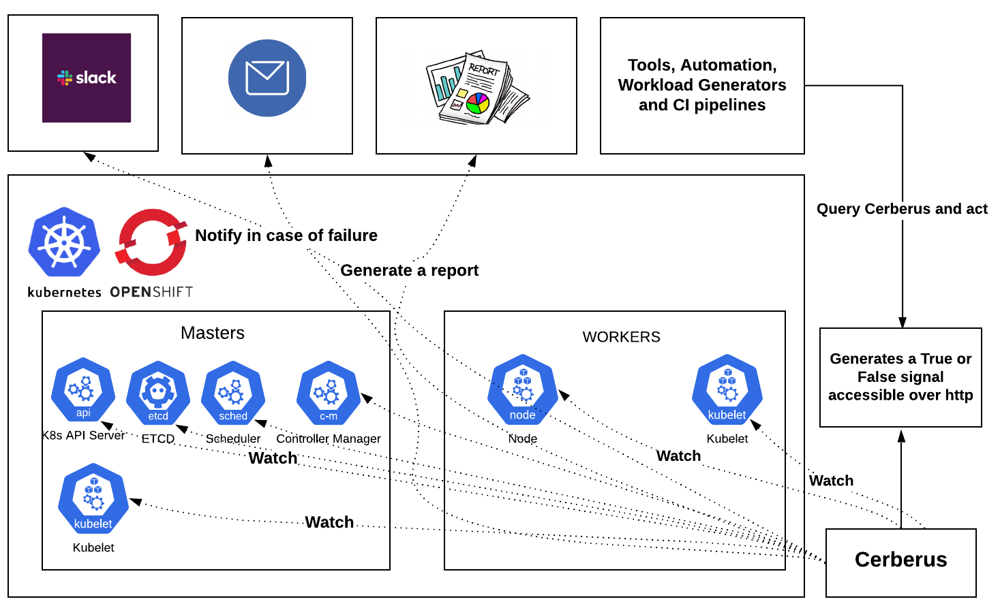

# Cerberus
Guardian of Kubernetes and OpenShift Clusters

Cerberus watches the Kubernetes/OpenShift clusters for dead nodes, system component failures/health and exposes a go or no-go signal which can be consumed by other workload generators or applications in the cluster and act accordingly.

### Workflow

### Installation
Instructions on how to setup, configure and run Cerberus can be found at [Installation](docs/installation.md).

### What Kubernetes/OpenShift components can Cerberus monitor?
Following are the components of Kubernetes/OpenShift that Cerberus can monitor today, we will be adding more soon.

Component                            | Description                                                                                                      | Working
-----------------------------------  | ---------------------------------------------------------------------------------------------------------------- | ------------------------- |
Nodes                                | Watches all the nodes including masters, workers as well as nodes created using custom MachineSets               | :heavy_check_mark:        |
Namespaces                           | Watches all the pods including containers running inside the pods in the namespaces specified in the config      | :heavy_check_mark:        |
Cluster Operators                    | Watches all Cluster Operators                                                                                    | :heavy_check_mark:        |
Masters Schedulability               | Watches and warns if masters nodes are marked as schedulable                                                     | :heavy_check_mark:        |
Routes                               | Watches specified routes                                                                                         | :heavy_check_mark:        |
CSRs                                 | Warns if any CSRs are not approved                                                                               | :heavy_check_mark:        |
Critical Alerts                      | Warns the user on observing abnormal behavior which might effect the health of the cluster                       | :heavy_check_mark:        |            
Bring your own checks                | Users can bring their own checks and Ceberus runs and includes them in the reporting as wells as go/no-go signal | :heavy_check_mark:        |

**NOTE**: It supports monitoring pods in any namespaces specified in the config, the watch is enabled for system components mentioned in the [config](https://github.com/openshift-scale/cerberus/blob/master/config/config.yaml) by default as they are critical for running the operations on Kubernetes/OpenShift clusters.

### How does Cerberus report cluster health?
Cerberus exposes the cluster health and failures through a go/no-go signal, report and metrics API.

#### Go or no-go signal
When the cerberus is configured to run in the daemon mode, it will continuosly monitor the components specified, runs a light weight http server at http://0.0.0.0:8080 and publishes the signal i.e True or False depending on the components status. The tools can consume the signal and act accordingly.

#### Report
The report is generated in the run directory and it contains the information about each check/monitored component status per iteration with timestamps. It also displays information about the components in case of failure. Refer [report](docs/example_report.md) for example.

#### Metrics API
Cerberus exposes the metrics including the failures observed during the run through an API. Tools consuming Cerberus can query the API to get a blob of json with the observed failures to scrape and act accordingly. For example, we can query for etcd failures within a start and end time and take actions to determine pass/fail for test cases or report whether the cluster is healthy or unhealthy for that duration.

- The failures in the past 1 hour can be retrieved in the json format by visiting http://0.0.0.0:8080/history.
- The failures in a specific time window can be retrieved in the json format by visiting http://0.0.0.0:8080/history?loopback=<interval>.
- The failures between two time timestamps, the failures of specific issues types and the failures related to specific components can be retrieved in the json format by visiting http://0.0.0.0:8080/analyze url. The filters have to be applied to scrape the failures accordingly.

### Slack integration
Cerberus supports reporting failures in slack. Refer [slack integration](docs/slack.md) for information on how to set it up.

### Node Problem Detector
Cerberus also consumes [node-problem-detector](https://github.com/kubernetes/node-problem-detector) to detect various failures in Kubernetes/OpenShift nodes. More information on setting it up can be found at [node-problem-detector](docs/node-problem-detector.md)

### Bring your own checks
Users can add additional checks to monitor components that are not being monitored by Cerberus and consume it as part of the go/no-go signal.  This can be accomplished by placing relative paths of files containing additional checks under custom_checks in config file. All the checks should be placed within the main function of the file. If the additional checks need to be considered in determining the go/no-go signal of Cerberus, the main function can return a boolean value for the same. Having a dict return value of the format {'status':status, 'message':message} shall send signal to Cerberus along with message to be displayed in slack notification. However, it's optional to return a value.
Refer to [example_check](https://github.com/openshift-scale/cerberus/blob/master/custom_checks/custom_check_sample.py) for an example custom check file.

### Alerts
Monitoring metrics and alerting on abnormal behavior is critical as they are the indicators for clusters health. Information on supported alerts can be found at [alerts](docs/alerts.md).
 

### Use cases
There can be number of use cases, here are some of them:
- We run tools to push the limits of Kubernetes/OpenShift to look at the performance and scalability. There are a number of instances where system components or nodes start to degrade, which invalidates the results and the workload generator continues to push the cluster until it is unrecoverable.

- When running chaos experiments on a kubernetes/OpenShift cluster, they can potentially break the components unrelated to the targeted components which means that the chaos experiment won't be able to find it. The go/no-go signal can be used here to decide whether the cluster recovered from the failure injection as well as to decide whether to continue with the next chaos scenario.

### Tools consuming Cerberus
- [Benchmark Operator](https://github.com/cloud-bulldozer/benchmark-operator): The intent of this Operator is to deploy common workloads to establish a performance baseline of Kubernetes cluster on your provider. Benchmark Operator consumes Cerberus to determine if the cluster was healthy during the benchmark run. More information can be found at [cerberus-integration](https://github.com/cloud-bulldozer/benchmark-operator#cerberus-integration).

- [Kraken](https://github.com/openshift-scale/kraken/): Tool to inject deliberate failures into Kubernetes/OpenShift clusters to check if it is resilient. Kraken consumes Cerberus to determine if the cluster is healthy as a whole in addition to the targeted component during chaos testing. More information can be found at [cerberus-integration](https://github.com/openshift-scale/kraken#kraken-scenario-passfail-criteria-and-report).

### Blogs and other useful resources
- https://www.openshift.com/blog/openshift-scale-ci-part-4-introduction-to-cerberus-guardian-of-kubernetes/openshift-clouds
- https://www.openshift.com/blog/reinforcing-cerberus-guardian-of-openshift/kubernetes-clusters

### Contributions
We are always looking for more enhancements, fixes to make it better, any contributions are most welcome. Feel free to report or work on the issues filed on github. 

[More information on how to Contribute](docs/contribute.md)

### Community
Key Members(slack_usernames): paige, rook, mffiedler, mohit, dry923, rsevilla, ravi
* [**#sig-scalability on Kubernetes Slack**](https://kubernetes.slack.com)
* [**#forum-perfscale on CoreOS Slack**](https://coreos.slack.com)

### Credits
Thanks to Mary Shakshober ( https://github.com/maryshak1996 ) for designing the logo.
